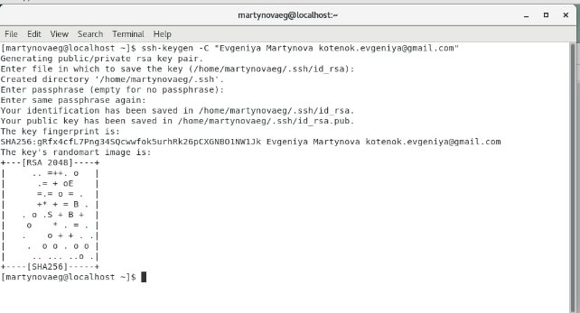
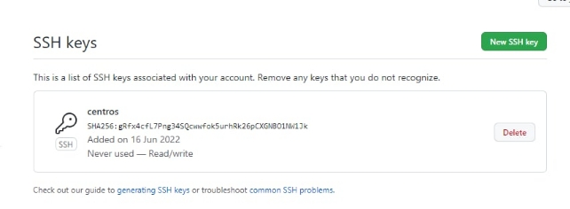
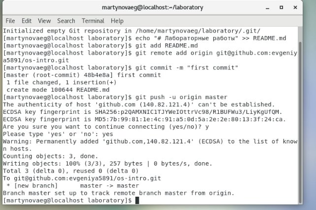
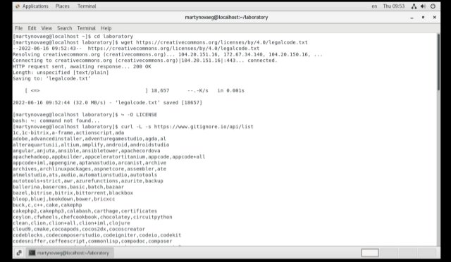
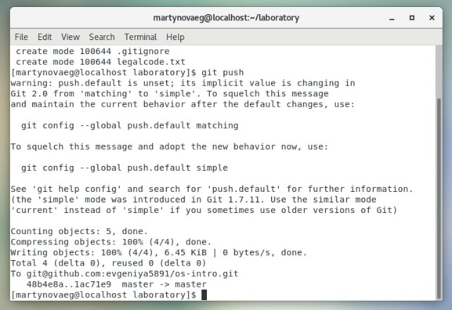
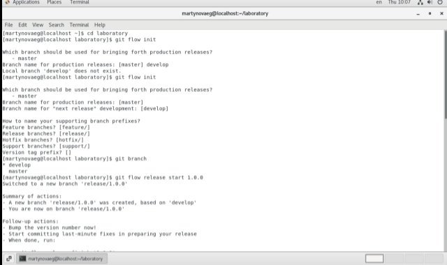
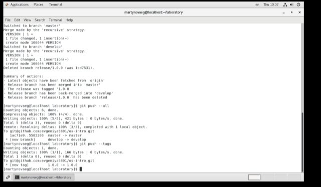

**РОССИЙСКИЙ УНИВЕРСИТЕТ ДРУЖБЫ НАРОДОВ**

**Факультет физико-математических и естественных наук**

**Кафедра прикладной информатики и теории вероятностей**

**ОТЧЕТ** 

**ПО ЛАБОРАТОРНОЙ РАБОТЕ № 	2**

*дисциплина:	Операционные системы*		 

Студент: Мартынова Е.Г.                                    

`	`Группа: нПмбв-01-18                                      

**МОСКВА**

2022 г.

**Лабораторная работа № 2. Управление версиями.**

**Цель работы:** изучить идеологию и применение средств контроля версий.

**Ход работы:**

1. **Настройка git** 

\- Учетная запись уже была создана. https://github.com/evgeniya5891

\- Генерация ключа:

\- Создание структуры каталога лабораторных работ согласно пункту М.2.:

1. **Подключение репозитория к github.**

\- Создайте репозиторий на GitHub. Для примера назовём его os-intro: [https://github.com/evgeniya5891/os-intro]()

– Рабочий каталог будем обозначать как laboratory. Вначале нужно перейти в этот каталог: cd laboratory

` `– Инициализирую системы git: git init

` `– Создаю заготовку для файла README.md: echo "# Лабораторные работы" >> README.md git add README.md

` `– Делаю первый коммит и выкладываю на github: git commit -m "first commit" git remote add origin ↪ git@github.com:/sciproc-intro.git git push -u origin master

1. **Первичная конфигурация.**

– Добавила файл лицензии: wget https://creativecommons.org/licenses/by/4.0/legalcode.txt ↪ -O LICENSE 

– Добавила шаблон игнорируемых файлов. Просмотрела список имеющихся шаблонов: curl -L -s https://www.gitignore.io/api/list Затем скачала шаблон для C: curl -L -s https://www.gitignore.io/api/c >> .gitignore https://www.gitignore. io/. 

– Добавила новые файлы: git add . 

– Выполнила коммит: git commit -a 

– Отправила на github: git push

1. **Конфигурация git-flow.**

–Инициализирую git-flow git flow init 

Префикс для ярлыков установила в v.

– Проверила, что я на ветке develop: git branch

– Создадала релиз с версией 1.0.0 git flow release start 1.0.0 

– Записала версию: echo "1.0.0" >> VERSION 

– Добавила в индекс: git add . git commit -am 'chore(main): add version' 

– Залила релизную ветку в основную ветку git flow release finish 1.0.0 

– Отправла данные на github git push --all git push --tags 

– Создадала релиз на github.

**Контрольные вопросы:**

1. Это место хранения кода. Как *dropbox*, только для разработчиков! Она заточена именно на разработку продуктов. То есть на хранение кода, синхронизацию работы нескольких человек, создание релизов.
1. Основные понятия VCS. •

Хранилище (repository), или репозитарий, — место хранения всех версий и служебной информации. 

Версия (revision), или ревизия, — состояние всех файлов на определенный момент времени, сохраненное в репозитарии, с дополнительной информацией. 

Commit («[трудовой] вклад», не переводится) — синоним версии; процесс создания новой версии.

1. Централизованные VCS. u Одно основное хранилище всего проекта u Каждый пользователь копирует себе необходимые ему. файлы из этого репозитория, изменяет и, затем, добавляет свои изменения обратно. Ø Subversion Ø CVS Ø TFS, VAULT Ø AccuRev. 13/70. Децентрализованные VCS. u У каждого пользователя свой вариант (возможно не один) репозитория.
1. u Хранение полной истории изменений u Описание причин всех производимых изменений u Откат изменений, если что-то пошло не так u Поиск причины и ответственного за появления ошибок в. программе u Совместная работа группы над одним проектом u Возможность изменять код, не мешая работе других. ... Терминология VCS. u Репозиторий - хранилище версий - в нем хранятся все документы вместе с историей их изменения и другой служебной информацией.
1. Вася первым закончил работу и обновил все нужные файлы в общей папке. Да, на тот момент всё работало. Но ведь Петя работал в файле, в котором ещё не было Васиных правок. Поэтому, когда он положил документы в хранилище, Васины правки были стерты. Остался только новый файл Sum.java, ведь его Петя не трогал. Хорошо хоть логика распределена! Если бы всё лежало в одном классе, было бы намного сложнее совместить правки Васи и Пети. А так достаточно было немного подправить файлы Main.java и GUI.java, вернув туда обработку кнопки. Ребята быстро справились с этим, а потом убедились, что в общем папке теперь лежит правильная версия кода. Собрали митинг (жаргон — собрание, чтобы обсудить что-то): — Как нам не допустить таких косяков в дальнейшем? — Давайте перед тем, как сохранять файлы в хранилище, забирать оттуда последние версии! А ещё можно брать свежую версию с утра. Например, в 9 часов. ... Это означает просто забрать из общего хранилища актуальную версию. Как если бы вы зашли в дропбокс и скопипастили себе последнюю версию файлов. Просто в VCS это делается при помощи командной строки или специального графического интерфейса типа Tortoise Hg.
1. Git — это система управления версиями. У Git две основных задачи: первая — хранить информацию о всех изменениях в вашем коде, начиная с самой первой строчки, а вторая — обеспечение удобства командной работы над кодом. Что такое репозиторий Git. Репозиторий Git — это место, где хранится ваш код и вся информация о его изменениях.
1. Наиболее часто используемые команды git: – создание основного дерева репозитория: git init – получение обновлений (изменений) текущего дерева из центрального репозитория: git pull – отправка всех произведённых изменений локального дерева в центральный репозиторий: git push – просмотр списка изменённых файлов в текущей директории: git status – просмотр текущих изменения: git diff – сохранение текущих изменений: – добавить все изменённые и/или созданные файлы и/или каталоги: git add . – добавить конкретные изменённые и/или созданные файлы и/или каталоги: git add имена\_файлов – удалить файл и/или каталог из индекса репозитория (при этом файл и/или каталог остаётся в локальной директории): git rm имена\_файлов – сохранение добавленных изменений: – сохранить все добавленные изменения и все изменённые файлы: git commit -am 'Описание коммита' – сохранить добавленные изменения с внесением комментария через встроенный редактор: git commit – создание новой ветки, базирующейся на текущей: git checkout -b имя\_ветки – переключение на некоторую ветку: git checkout имя\_ветки (при переключении на ветку, которой ещё нет в локальном репозитории, она будет создана и связана с удалённой) – отправка изменений конкретной ветки в центральный репозиторий: git push origin имя\_ветки – слияние ветки с текущим деревом: git merge --no-ff имя\_ветки – удаление ветки: – удаление локальной уже слитой с основным деревом ветки: git branch -d имя\_ветки – принудительное удаление локальной ветки: git branch -D имя\_ветки – удаление ветки с центрального репозитория: git push origin :имя\_ветки
1. Удаленный репозиторий может находиться на вашем локальном компьютере. Вполне возможно, что удалённый репозиторий будет находиться на том же компьютере, на котором работаете вы. Слово «удалённый» не означает, что репозиторий обязательно должен быть где-то в сети или Интернет, а значит только — где-то ещё. Работа с таким удалённым репозиторием подразумевает выполнение стандартных операций отправки и получения, как и с любым другим удалённым репозиторием. Просмотр удалённых репозиториев. Для того, чтобы просмотреть список настроенных удалённых репозиториев, вы можете запустить команду git remote. ... В предыдущих разделах мы уже упоминали и приводили примеры добавления удалённых репозиториев, сейчас рассмотрим эту операцию подробнее. Для того, чтобы добавить удалённый репозиторий и присвоить ему имя (shortname), просто выполните команду git remote add <shortname> <url>: $ git remote origin $ git remote add pb https://github.com/paulboone/ticgit $ git remote -v origin https://github.com/schacon/ticgit (fetch) origin https://github.com/schacon/ticgit (push) pb https://github.com/paulboone/ticgit (fetch) pb https://github.com/paulboone/ticgit (push).
1. Ветки нужны для того, чтобы программисты могли вести совместную работу над проектом и не мешать друг другу при этом.
1. Игнорируемые файлы — это, как правило, артефакты сборки и файлы, генерируемые машиной из исходных файлов в вашем репозитории, либо файлы, которые по какой-либо иной причине не должны попадать в коммиты.

**Вывод:** Сегодня я Изучила идеологию и применение средств контроля версий.

Узнала как работать с [https://github.com/]() и изучила множество команд для работы с ним.
