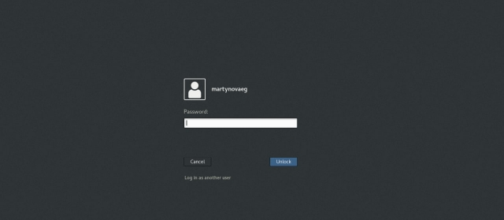
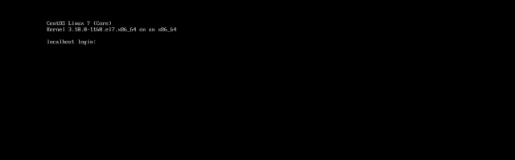
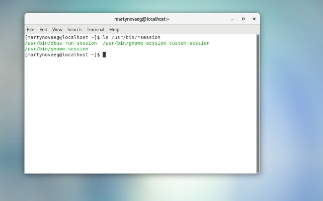
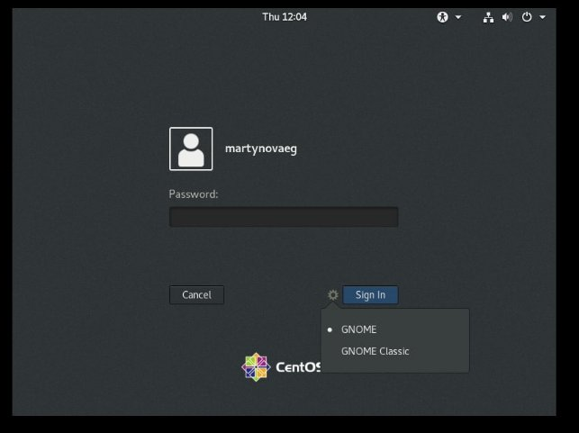
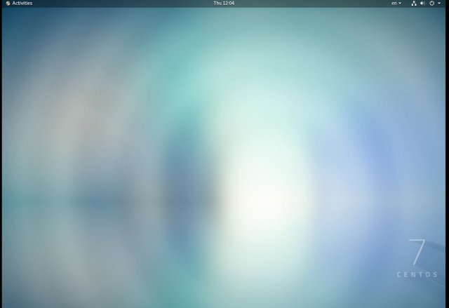
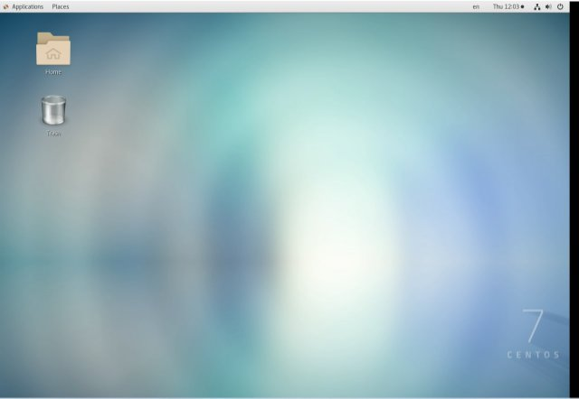
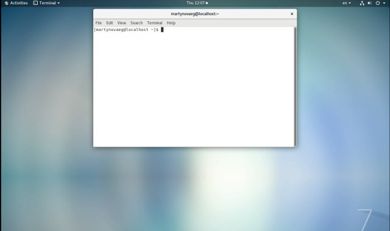
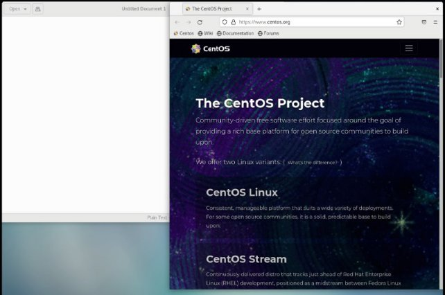

**РОССИЙСКИЙ УНИВЕРСИТЕТ ДРУЖБЫ НАРОДОВ**

**Факультет физико-математических и естественных наук**

**Кафедра прикладной информатики и теории вероятностей**

**ОТЧЕТ** 

**ПО ЛАБОРАТОРНОЙ РАБОТЕ № 	4**

*дисциплина:	Операционные системы*		 

Студент: Мартынова Е.Г.                                    

`	`Группа: нПмбв-01-18                                      

**МОСКВА**

2022 г.

**Лабораторная работа № 4. Знакомство с операционной системой Linux**

**Цель работы:** Познакомиться с операционной системой Linux, получить практические навыки работы с консолью и некоторыми графическими менеджерами рабочих столов операционной системы.

**Ход работы:**

1. Ознакомилась с теоретическим материалом.
1. Загрузила компьютер.

1. Перешла на текстовую консоль. С 1 до 6 доступно консолей из них 2 графические.

1. Перемещалась между текстовыми консолями. Надо нажимать Ctrl + Alt + F4, где вместо F4 можно переключаться с 1 до 6 консолей.
1. Зарегистрировалась в текстовой консоли операционной системы. Использовал логин martynovaeg, при вводе пароля не отображаются символы.
1. Завершила консольный сеанс. Чтобы завершить свой сеанс с консолью нужно нажать эту комбинацию Ctrl + D, ну или написать exit.
1. Переключилась на графический интерфейс. Для переключения к графическим интерфейсам я нажал Ctrl + Alt + F1 и Ctrl + Alt + F2, только два комбинации поддерживают графический интерфейс.
1. Ознакомилась с менеджером рабочих столов. Чтобы узнать менеджер рабочего стола гугл, ls /usr/bin/\*session  ввела эту комбинацию и получила ответ.

1. Поочерёдно зарегистрировалась в разных графических менеджерах рабочих столов (GNOME, KDE, XFCE) и оконных менеджерах (Openbox). Продемонстрировала разницу между ними, сделав снимки экрана (скриншоты). Графические менеджеры установлены на компьютере .

1. ` `Изучила список установленных программ. Запустила поочерёдно браузер, текстовой редактор, текстовой процессор, эмулятор консоли. 

**Контрольные вопросы:**

**1. Что такое компьютерный терминал? Есть ли, по вашему мнению, у него преимущества перед графическим интерфейсом?**

Компьютерный терминал это устройство для отображения данных компьютера. Между графическим интерфейсом и терминалом нет отличия, больше тут вопрос на удобства пользователя и желания.

**2. Что такое входное имя пользователя?**

Входное имя пользователя это имя под которым пользователю дается id, а также для отслеживания действий пользователя.

**3. В каком файле хранятся пароли пользователей? В каком виде они хранятся?**

Пароли пользователей хранятся в файле под названием passwd, в формате plain text document (text/plain)

**4. Где хранятся настройки пользовательских программ?**

В домашнем каталоге

**5. Какое входное имя у администратора ОС Unix?**

root

**6. Имеет ли администратор доступ к настройкам пользователей?**

Да

**7. Каковы основные характеристики многопользовательской модели разграничения доступа?**

Можно определить для пользователя черту которую не может переступить, то есть взглянуть системе под капотом.

**8. Какую информацию кроме пароля и логина содержит учётная запись пользователя?**

– внутренний идентификатор пользователя

– идентификатор группы

– анкетные данные пользователя

– домашний каталог

– указатель на программную оболочку

**9. Что такое UID и GID? Расшифруйте эти аббревиатуры.**

User ID - внутренний идентификатор пользователя и Group ID - идентификатор группы.

**10. Что такое GECOS?**

Анкетные данные пользователя или GECOS являются необязательным параметром учётной записи и могут содержать реальное имя пользователя (фамилию, имя), адрес, телефон.

**11. Что такое домашний каталог? Какие файлы хранятся в нем?**

В домашнем каталоге пользователя хранятся данные (файлы) пользователя, настройки рабочего стола и других приложений. Содержимое домашнего каталога обычно не доступно другим пользователям с обычными правами и не влияет на работу и настройки рабочей среды других пользователей.

**12. Как называется ваш домашний каталог?**

Мой домашний каталог называется matrynovaeg

**13. Имеет ли администратор возможность изменить содержимое домашнего каталога пользователя?**

Да

**14. Что хранится в файле /etc/passwd?**

Учётные записи пользователей хранятся в файле /etc/passwd, который имеет следующую структуру:

login:password:UID:GID:GECOS:home:shell

Например, учётные записи пользователей root и sam в файле /etc/passwd

могут быть записаны следующим образом:

root:x:0:0:root:/root:/bin/bash

sam:x:1000:100::/home/sam:/bin/bash

**15. Как, просмотрев содержимое файла /etc/passwd, узнать, какие пользователи не смогут войти в систему?**

Символ \* в поле password некоторой учётной записи в файле/etc/passwd означает, что пользователь не сможет войти в систему.

**16. Что такое виртуальные консоли? Как вы думаете, что означает слово «виртуальный» в данном контексте?**

Виртуальные консоли — реализация концепции многотерминальной работы в рамках одного устройства. Виртуальный в данном контексте означает несколько консолей отделенных друг от друга. Им можно полноценно работать как отдельный консоль.

**17. Зачем нужна программа getty?**

Программа getty предназначена для управления доступом к физическим и виртуальным терминалам. Например: Те же tty1 по tty6 работают этой программой.

**18. Что такое сеанс работы?**

Процесс взаимодействия пользователя с системой с момента регистрации до выхода называется сеансом работы.

**19. Что такое тулкит?**

Toolkit (Tk, «набор инструментов», «инструментарий»)— кроссплатформенная библиотека базовых элементов графического интерфейса, распространяемая с открытыми исходными текстами.

**20. Какие основные тулкиты существуют в системе Unix?**

В системе Unix используются следующие основные тулкиты:

– GTK+ (сокращение от GIMP Toolkit) — кроссплатформенная библиотека элементов интерфейса;

– Qt — кросс-платформенный инструментарий разработки программного обеспечения на языке программирования C++.

GTK+ состоит из двух компонентов:

– GTK — содержит набор элементов пользовательского интерфейса (таких, как кнопка, список, поле для ввода текста и т. п.) для различных задач;

– GDK — отвечает за вывод информации на экран, может использовать для этого X Window System, Linux Framebuffer, WinAPI.

На основе GTK+ построены рабочие окружения GNOME, LXDE и Xfce.

Естественно, эти тулкиты могут использоваться и за пределами «родных» десктопных окружений.

Qt используется в среде KDE (Kool Desktop Environment).

**Вывод:** Сегодня я познакомилась с операционной системой Linux, получила практические навыки работы с консолью и некоторыми графическими менеджерами рабочих столов операционной системы.
