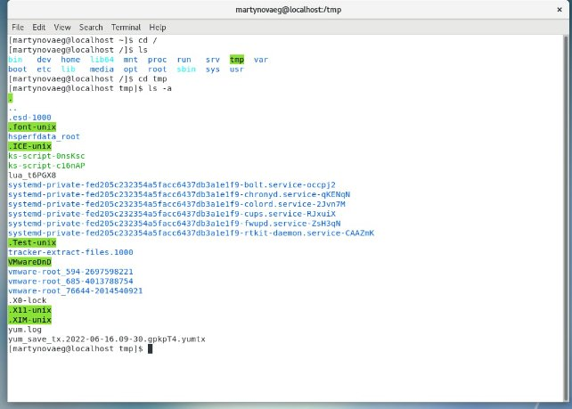
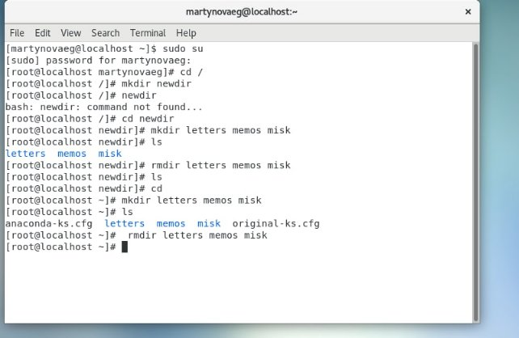
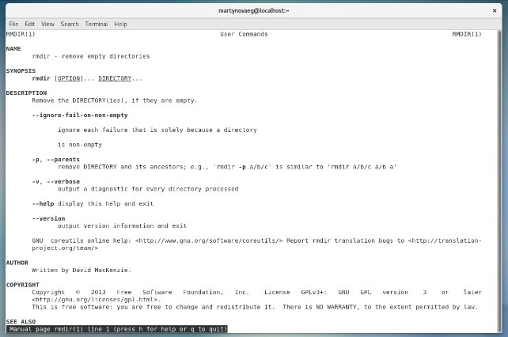
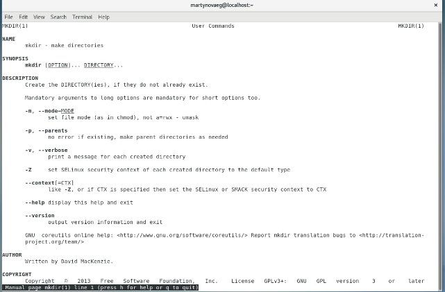
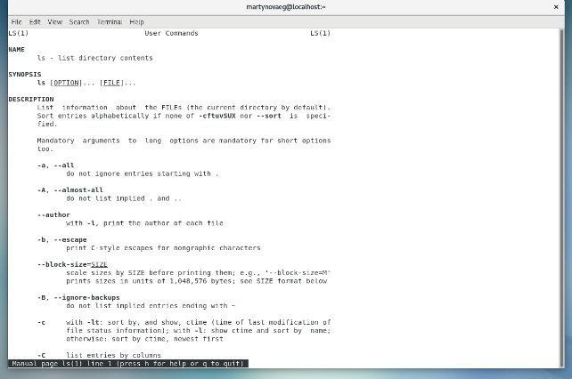
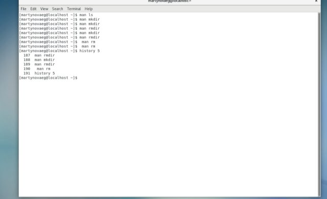

**РОССИЙСКИЙ УНИВЕРСИТЕТ ДРУЖБЫ НАРОДОВ**

**Факультет физико-математических и естественных наук**

**Кафедра прикладной информатики и теории вероятностей**

**ОТЧЕТ** 

**ПО ЛАБОРАТОРНОЙ РАБОТЕ № 	5**

*дисциплина:	Операционные системы*		 

Студент: Мартынова Е.Г.                                    

`	`Группа: нПмбв-01-18                                      

**МОСКВА**

2022 г.

**Лабораторная работа № 5. Основы интерфейса взаимодействия пользователя с системой Unix на уровне командной строки.**

**Цель работы:** Приобретение практических навыков взаимодействия пользователя с системой посредством командной строки.

**Ход работы:**

1. Переходим на главный каталог и переходим в директорию tmp и открываем содержимое с командой –a для отображения скрытых файлов

1. Переходим в директорию var, создаем новую директорию newdir. Переходим в главную директорию и создаем директории с именами letters memos misk и удаляем одной командой

1. Работа с командой man

1. Работа с командой history где отображается последние пять команд

**Листинг терминала**

**martynovaeg@localhost:~$ cd**

+**martynovaeg@localhost:~$ cd /tmp**

**martynovaeg@localhost:/tmp$ ls -a**

**.font-unix**

**.ICE-unix**

**sddm-:0-yqiMhF**

**sddm-auth41f69764-3b66-4855-9dff-db146a380029**

**snap.snap-store**

**ssh-bKnsNpYjLBp3**

**systemd-private-cb88c6b08b5346fc8136314a42bb9590-colord.service-5mzbbg**

**systemd-private-cb88c6b08b5346fc8136314a42bb9590-fwupd.service-AjwOZe**

**systemd-private-cb88c6b08b5346fc8136314a42bb9590-haveged.service-gZBoSg**

**systemd-private-cb88c6b08b5346fc8136314a42bb9590-ModemManager.service-OJTsni**

**systemd-private-cb88c6b08b5346fc8136314a42bb9590-switcheroo-control.service-fO0wfi**

**systemd-private-cb88c6b08b5346fc8136314a42bb9590-systemd-logind.service-txn7Af**

**systemd-private-cb88c6b08b5346fc8136314a42bb9590-systemd-resolved.service-bXD8Ff**

**systemd-private-cb88c6b08b5346fc8136314a42bb9590-systemd-timesyncd.service-yE2Yqj**

**systemd-private-cb88c6b08b5346fc8136314a42bb9590-upower.service-vyjlNf**

**.Test-unix**

**tracker-extract-files.1000**

**tracker-extract-files.126**

**.X11-unix**

**.XIM-unix**

**martynovaeg@localhost:/tmp$ cd /var**

**martynovaeg@localhost:/var$ cd /spool**

**bash: cd: /spool: No such file or directory**

**martynovaeg@localhost:/var$ cd**

**martynovaeg@localhost:~$ mkdir newdir**

**martynovaeg@localhost:~$ cd newdir**

**martynovaeg@localhost:~/newdir$ mkdir letters memos misk**

**martynovaeg@localhost:~/newdir$ ld**

**ld: no input files**

**martynovaeg@localhost:~/newdir$ ls**

**letters memos misk**

**martynovaeg@localhost:~/newdir$ rmdir letters memos misk**

**martynovaeg@localhost:~/newdir$ ls**

**martynovaeg@localhost:~/newdir$ cd**

**martynovaeg@localhost:~$ mkdir letters memos misk**

**martynovaeg@localhost:~$ ls**

**Desktop Downloads letters misk newdir Public snap Videos**

**Documents etc.save memos Music Pictures Shared Templates**

**martynovaeg@localhost:~$ rmdir letters memos misk**

**martynovaeg@localhost:~$ ls**

**Desktop Downloads Music Pictures Shared Templates**

**Documents etc.save newdir Public snap Videos**

**martynovaeg@localhost:~$ rmdir newdir**

**martynovaeg@localhost:~$ ls**

**Desktop Documents Downloads etc.save Music Pictures Public Shared snap Templates Videos**

**martynovaeg@localhost:~$ ls man**

**ls: cannot access 'man': No such file or directory**

**martynovaeg@localhost:~$ man ls**

**martynovaeg@localhost:~$ man cd pwd**

**No manual entry for cd**

**martynovaeg@localhost:~$ man cd**

**No manual entry for cd**

**martynovaeg@localhost:~$ man mkdir**

**martynovaeg@localhost:~$ man rmdir**

**martynovaeg@localhost:~$ man rm**

**martynovaeg@localhost:~$ history 5**

**119 man cd**

**120 man mkdir**

**121 man rmdir**

**122 man rm**

**123 history 5**

**martynovaeg@localhost:~$ man rm^C**

**martynovaeg@localhost:~$**

**Контрольные ответы :**

1. Разновидность текстового интерфейса между человеком и компьютером
2. martynovaeg@localhost:~$ pwd

/home/beaumer

3. martynovaeg@localhost:~$ ls -F

Desktop/ Downloads/ Music/ Public/ snap/ Videos/

Documents/ etc.save Pictures/ Shared@ Templates/

4. martynovaeg@localhost:/tmp$ ls -a

.

..

.font-unix

.ICE-unix

sddm-:0-yqiMhF

sddm-auth41f69764-3b66-4855-9dff-db146a380029

snap.snap-store

ssh-bKnsNpYjLBp3

systemd-private-cb88c6b08b5346fc8136314a42bb9590-colord.service-5mzbbg

systemd-private-cb88c6b08b5346fc8136314a42bb9590-fwupd.service-AjwOZe

systemd-private-cb88c6b08b5346fc8136314a42bb9590-haveged.service-gZBoSg

systemd-private-cb88c6b08b5346fc8136314a42bb9590-ModemManager.service-OJTsni

systemd-private-cb88c6b08b5346fc8136314a42bb9590-switcheroo-control.service-fO0wfi

systemd-private-cb88c6b08b5346fc8136314a42bb9590-systemd-logind.service-txn7Af

systemd-private-cb88c6b08b5346fc8136314a42bb9590-systemd-resolved.service-bXD8Ff

systemd-private-cb88c6b08b5346fc8136314a42bb9590-systemd-timesyncd.service-yE2Yqj

systemd-private-cb88c6b08b5346fc8136314a42bb9590-upower.service-vyjlNf

.Test-unix

tracker-extract-files.1000

tracker-extract-files.126

.X11-unix

.XIM-unix

5. martynovaeg@localhost:/tmp$ mkdir newcat

martynovaeg@localhost:/tmp$ rmdir newcat

6. history 10 (за последние 10 команд)

8. Можно запустить несколько команд с помощью операторов && и ||

Например: sudo apt-get update && sudo apt-get upgrade -y

9. \a Звонок («сигнал тревоги» - делает так, что компьютер издаёт сигнал)

\b Возврат на одну позицию

\n Новая строка. На Unix подобных системах это воспроизводит разрыв страницы.

\r Возврат каретки

\t Табуляция

10. Команда ls –l показать детализированое представление файлов и директорий в текущей директории.
11. Абсолютный путь показывает точное местонахождение файла, а относительный показывает путь к файлу относительно какой-либо "отправной точки" (файл, программа и т.д.).
12. Через команду man
13. Tab — автоматическое завершение набора имени файла, директории или команды.

**Вывод:** Сегодня я приобрела практические навыки взаимодействия пользователя с системой посредством командной строки.
